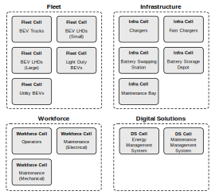

# bevcost
> **bevcost** is a Python package that simplifies the total cost of ownership (TCO) analysis of BEV fleets in mining.

The package is designed for engineers, operations analysts and consultants to support decision-making and perform techno-economic analyses.

The model considers a range of cost components under the “total cost of ownership”. The model has initially been developed for loading & hauling mining vehicles, with energy and power calculations based off of the operating hours for these vehicles. The TCO model also only considers battery electric vehicles; hybrid, plug-in hybrid, hydrogen fuel cell and internal combustion engine vehicles are outside the scope of the model’s cost analysis capabilities.

Cost components in the TCO model:
- Purchase costs of vehicles, electrical equipment, digital solutions
- Subscription costs of software, services
- Construction costs of infrastructure
- Energy & power costs
- Maintenance & repair costs
- Labour costs
- GHG-related costs & subsidies

There are four classes that each describe a primary type of object the TCO model analyses. The classes are: FleetCell, InfraCell, WorkforceCell and DigitalSolutionsCell.

For a detailed description of how the TCO model works, check out the [project documentation](https://bevcost.readthedocs.io/en/latest/background.html).

## Release History

The development of the TCO model began as part of the EVMO (Electric Vehicles in Mining Operations) project. The EVMO project was funded by Natural Resources Canada (NRCan) and MICA and ran from 2024-2025.

The project aimed to investigate challenges with adopting battery electric vehicles in underground mining operations and we quickly found that the “total cost of ownership” concept was central to decision making at the fleet level. However, we also found that TCO analyses varied significantly between companies and came with many embedded assumptions that can dramatically shift the outcome for decision makers.

* Version 0.0.1
    * Work in progress

## Meta

Edward Fagan – [Zero Nexus](https://zero.nexus) – edward@zero.nexus

Distributed under the GNU General Public License v3.0. See ``LICENSE`` for more information.
