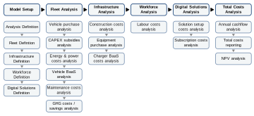

==========
Background
==========

Motivation
==========
The development of the TCO model began as part of the EVMO (Electric Vehicles in Mining Operations) project. The EVMO project was funded by Natural Resources Canada (NRCan) and MICA and ran from 2024-2025. 

The project aimed to investigate challenges with adopting battery electric vehicles in underground mining operations and we quickly found that the "total cost of ownership" concept was central to decision making at the fleet level. However, we also found that TCO analyses varied significantly between companies and came with many embedded assumptions that can dramatically shift the outcome for decision makers.

We decided to dedicate a portion of the EVMO project to building an open source TCO model that miners could use to bring clarity and consistency to their analyses. The goal of this Python TCO package is to create a modular platform for analysts and engineers working in mining decarbonization to perform TCO analyses that can be adapted and extended as necessary by the community.

A secondary objective of this project was to create a tool and set of examples for educational use. Our team (link to Zero Nexus) regularly run half/full day courses at conferences like CIM Connect, and we get regularly asked for more detailed examples of this kind of financial and techno-economic analysis to help demonstrate the business case for BEVs in mining. We're aiming to use this TCO package in future courses and research activities.  

TCO Model Overview
==================
What the model *does*: costs analysis
-------------------------------------
The cost analysis uses a variety of input parameters to determine the purchasing and operating costs for a BEV fleet. The model can consider just the vehicle costs alone, or it's scope can extend to the infrastructure and other services required to run a BEV mining fleet. For example, charging equipment and fixed infrastructure like dedicated maintenance or charging bays may also be required for the BEV fleet. The TCO model can incorporate extra costs associated with electric vehicle support equipment, infrastructure construction and operation, workforce costs and digital solutions like energy management software or Battery As A Service (BAAS) subscriptions.

What the model *doesn't do*: duty cycle/energy analysis
-------------------------------------------------------
The TCO model is not capable of analysing the duty cycles for BEVs in the mining fleet. External software is required to forecast the charging schedules and productivity of the BEV fleet. The TCO model takes the results of this kind of analysis as its input. For example, a mine planning software can produce the estimated monthly operating hours for each type of vehicle in the fleet over the life of mine. These operating hours are then used by the TCO model to estimate the energy costs, labour costs and other costs of the fleet.

Framework for comparing costs
-----------------------------
The model considers a range of cost components under the "total cost of ownership". The model has initially been developed for loading & hauling mining vehicles, with energy and power calculations based off of the operating hours for these vehicles. The TCO model also only considers battery electric vehicles; hybrid, plug-in hybrid, hydrogen fuel cell and internal combustion engine vehicles are outside the scope of the model's cost analysis capabilities. 

Cost components in the TCO model:
	* Purchase costs of vehicles, electrical equipment, digital solutions
	* Subscription costs of software, services
	* Construction costs of infrastructure
	* Energy & power costs
	* Maintenance & repair costs
	* Labour costs
	* GHG-related costs & subsidies

Model classes
-------------
There are four classes that each describe a primary type of object the TCO model uses. The classes are: *FleetCell*, *InfraCell*, *WorkforceCell* and *DigitalSolutionsCell*. An example of a TCO analysis is shown in the figure below, made up of multiple objects from each class. 

.. image:: images/TCO_Model.svg
   
*A block diagram showing an example TCO analysis. There are several instances of each of the four classes shown (FleetCell, InfraCell, WorkforceCell and DigitalSolutionsCell).*

*FleetCell*
^^^^^^^^^^^
The *FleetCell* is used to represent a fleet of BEVs. Each instance of this class should represent a single type of vehicle, e.g. 7T LHDs or 50T haul trucks. In this way the overall fleet is represented by a number of FleetCell objects.

*InfraCell*
^^^^^^^^^^^
The *InfraCell* is used to represent any BEV-related infrastructure. Infrastructure types include charging equipment, electrical equipment, charging stations and maintenance bays. As with the FleetCell, a single instance of this class represents one infrastructure type. 

*WorkforceCell*
^^^^^^^^^^^^^^^
The *WorkforceCell* represents a group of workers all with the same vocation/role. 

*DigitalSolutionsCell*
^^^^^^^^^^^^^^^^^^^^^^
The *DigitalSolutionsCell* is used to represent digital solutions (IT/OT products) used to support the BEV fleet, e.g. an energy management system or vehicle automation solutions.

TCO analysis process
--------------------
The actual TCO analysis process is straightforward, once the input data has been created. The flowchart below shows the main calculation steps, from model setup to the main calculations for each class and the final cost summaries.

*Flowchart showing the major steps in a TCO analysis from model setup to total costs analysis, with calculations for specific cost components shown beneath each step.*

The TCO model is designed primarily for forecasting total cost of BEV fleet ownership. The cost analyses use parametric relationships to determine a first estimate cost of purchasing and operating a BEV fleet and the associated equipment. This forecasting activity is aimed at supporting mine designers, consultants and analysts in assessing the viability of electrified fleets for their mine.

However, the model could also be used for analysing actual incurred costs and for cross-checking/reconciliation with original forecasted values. In this scenario, the appropriate fleet, infrastructure, workforce, etc. objects would be generated to hold the actual cost histories for each cost component. Then the "Total Costs Analysis" step would proceed to determine the actual annual cashflows and total cost breakdown for the real fleet. Future examples will demonstrate this use case for the model.

Input Parameters
================
Input file
----------
JSON files are used to store the input data for TCO analyses. The first input file is the *equipment.json* file, which acts like a library of input parameters for the equipment, infrastructure and software to be analysed.

The JSON file is structured as a dictionary with the following four keys: *vehicles*, *support equipment*, *infrastructure*, and *digital solutions*. The file contains a list of models with associated data (saved as dictionaries) within each of these four categories. See image below.

.. code-block:: python
    
  {
    "vehicles":
      [
        {
          "model": "LHD 1",
          "make": "BEV Original Equipment Manufacturer",
          "type": "LHD",
          "powertrain": "BEV",
          "battery capacity": 250,
          "usable battery capacity": 0.85,
          "energy consumption": 50,
          "charging time": 4,
          "charging power": 250,
          "evse model": "LHD 1 Charger",
          "BaaS monthly rate": 12000,
          "unit price": 1500000,
          "maintenance costs": 
            {
              "Machine Hours": [2500, 5000, 7500, 10000],
              "Major Components": [10000, 20000, 25000, 30000]
            }
        }
      ]
  }

The examples provided in the package repository show the kinds of input parameters required for each of the equipment categories.